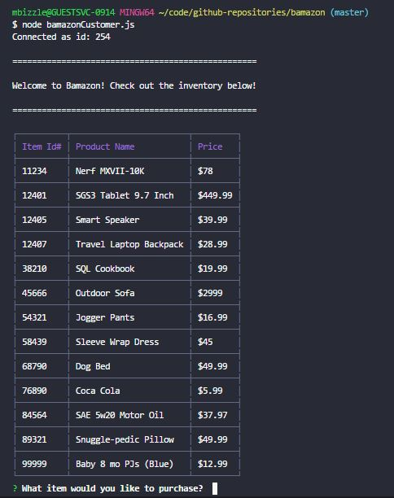
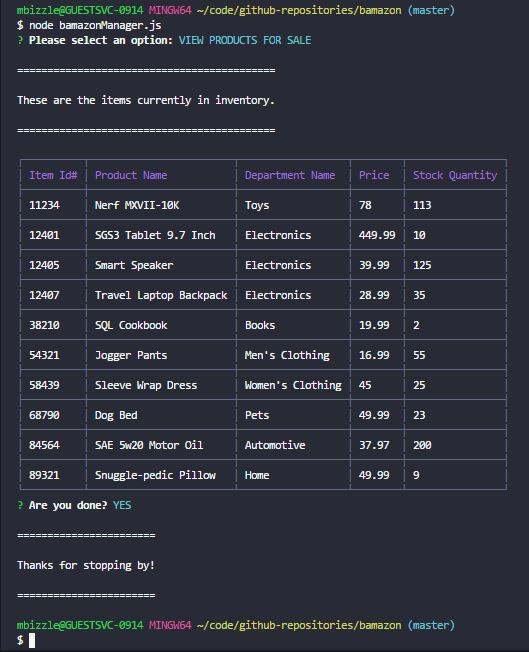
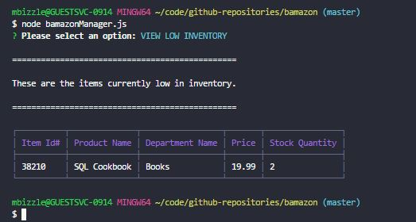
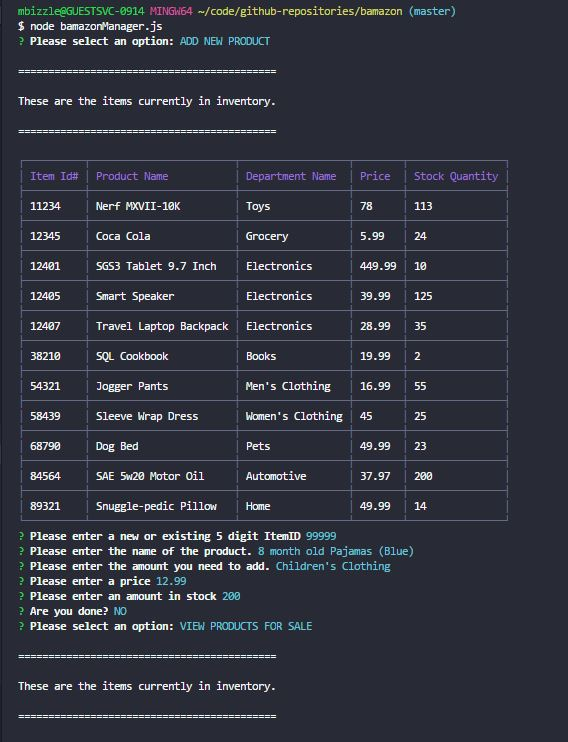
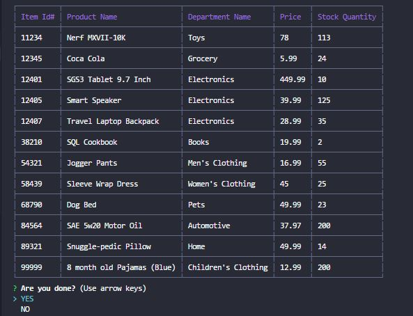
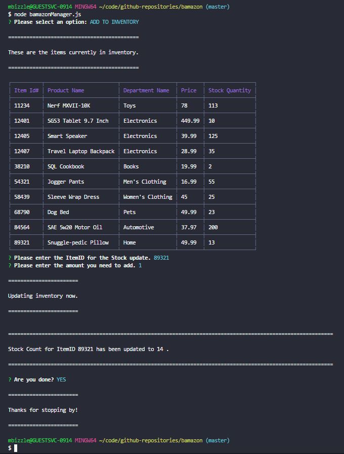
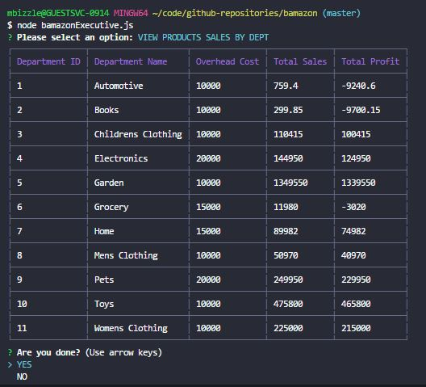
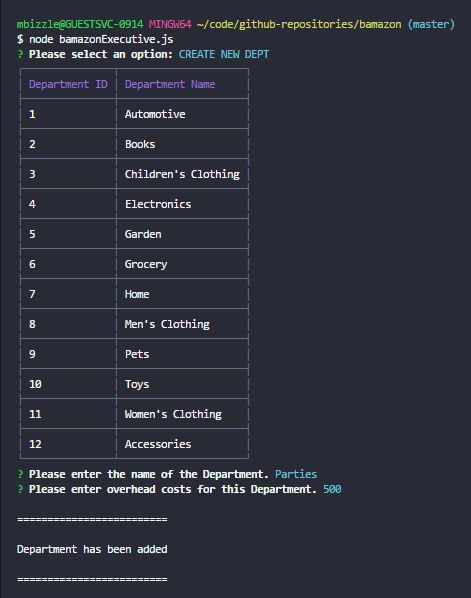

# Bamazon

### Synopsis
***

Creating an Amazon-like storefront with MySQL and Node. 

### MySQL Database Setup

* In order to run this application, you will need to have MySQL database already set up on your machine. If you don't, visit the [MySQL installation page](https://dev.mysql.com/doc/refman/5.6/en/installing.html) to install the version you need for your operating system. 

* Once you have MySQL isntalled, you will be able to create the *Bamazon* database and the *products* table with the SQL code found in [Bamazon.sql](Bamazon.sql). Run this code inside your MySQL client or command line. 

##### Bamazon Customer
***

The Bamazon App allows users to view the current items available for purchase.  The user will then be prompted to make a selection for a list of items

##### Bamazon Manager
***
The Bamazon App has a managerial section allowing managers to view and edit the inventory of the store.  The user will be prompted to choose from the following options:

##### Bamazon Executive
***
The Bamazon App has an Executive section as well.  This section allows Executives to view the total profits of the store categorized by department and add new departments.  

#### Author:
***
Michael Bizzle [GitHub](https://github.com/mbizzle1464)

#### Technologies Used:
***
* Javascript
* nodeJS
* MySQL
* npm packages
    * MySQL
    * inquirer
    * CLI Table
    * Colors